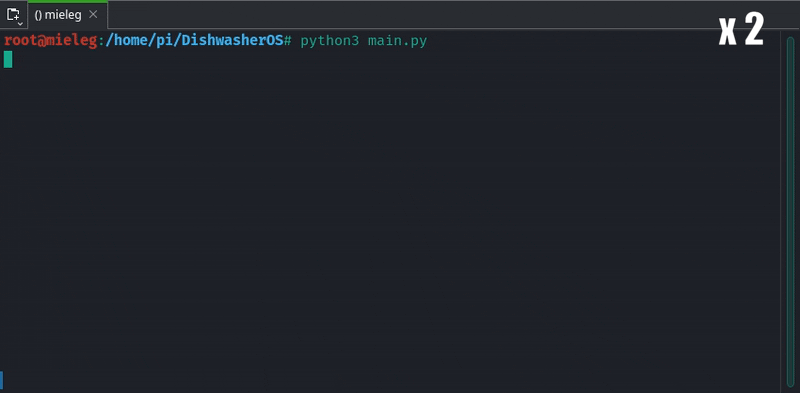

# DishwasherOS

Firmware application for the `SmartDishwasher` project running on the controller of the dishwasher. The software is responsible for recording process data of the running wash circle in connection with the original control unit of the dishwasher and forwarding it via Wi-Fi connection to the [DishwasherBackend](https://github.com/AmbroAnalog/DishwasherBackend).

The software runs on a Raspberry Pi and starts automatically at boot time.

> :sparkles: This is a component of the `SmartDishwasher` project. **FOR A PROJECT OVERVIEW PLEASE VISIT THE [SmartDishwaser](https://github.com/AmbroAnalog/SmartDishwasher) REPOSITORY.**

In conjunction with projects [DishwasherFrontend](https://github.com/AmbroAnalog/DishwasherFrontend) and [DishwasherBackend](https://github.com/AmbroAnalog/DishwasherBackend)

## Compatibility

> :exclamation: ATTENTION! The code distributed in this repository is only compatible with one specific dishwasher type and needs heavy modification on top of that! 

Developed for the following dishwasher model: **MIELE G 470 SC** 
List of supported wash cycles:
- "`Intensiv 65°C`"
- "`Universal Plus 65°C`"
- "`Universal Plus 55°C`"
- "`Universal 65°C`"
- "`Universal 55°C`"
- "`Spar 65°C`"
- "`Spar 55°C`"
- "`Kurz 45°C`"
- "`Fein 45°C`"
- "`Kalt`"

## Start example
